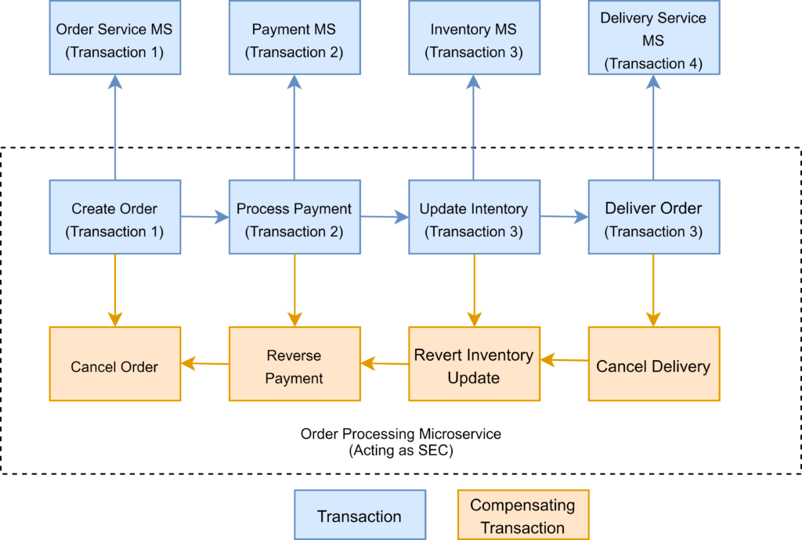
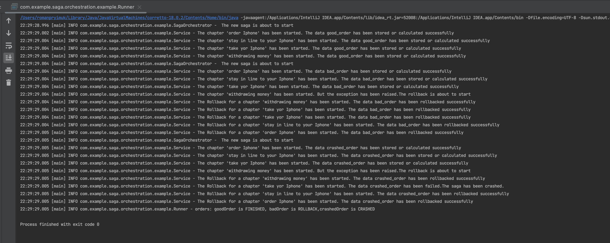
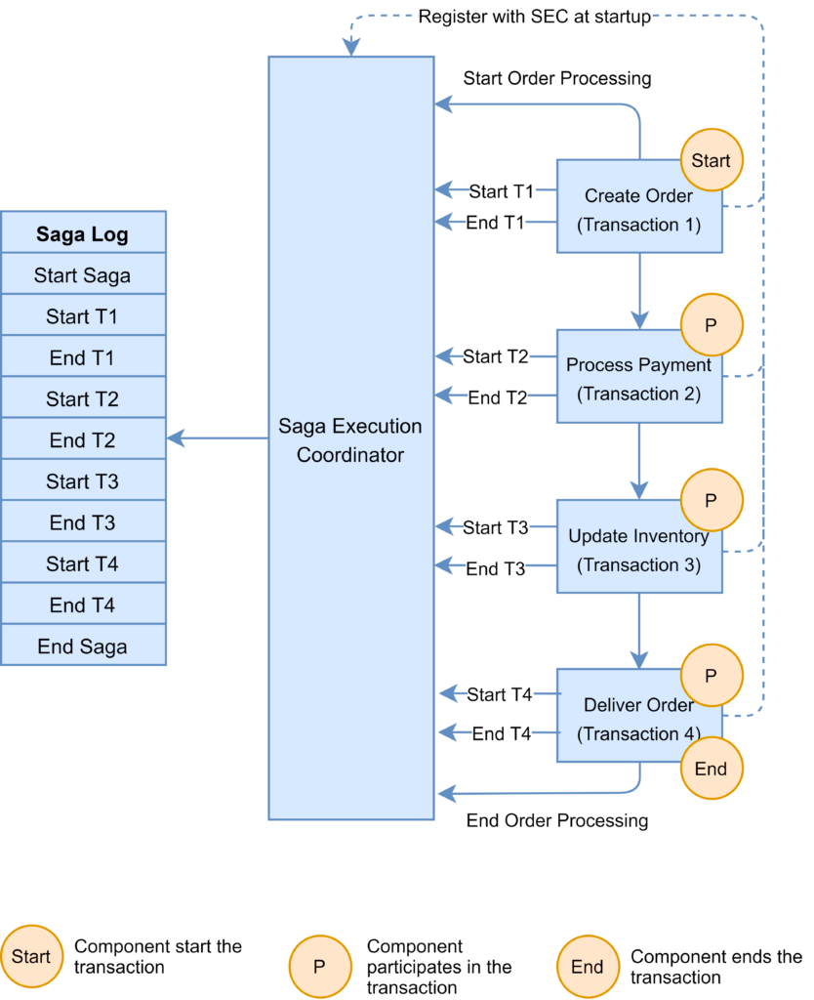
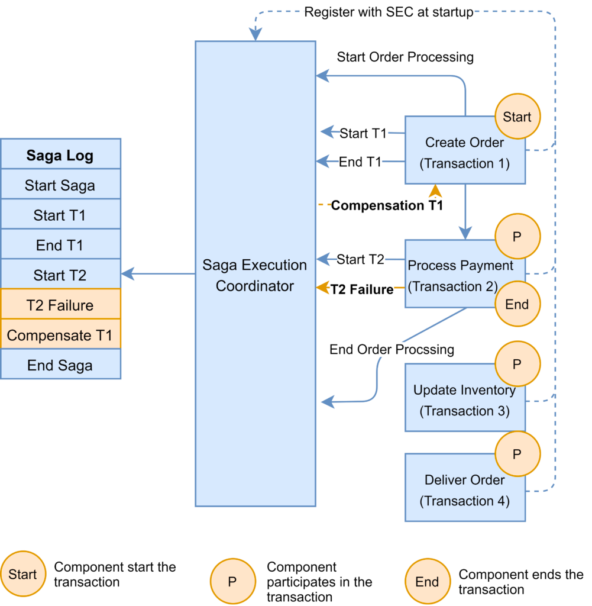
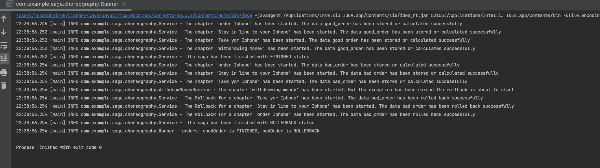

# Two-Phase Commit

Let's begin from `two-phase commit` because it super basic and very understandable. 

As the name indicates, the two-phase commit protocol runs a distributed transaction in two phases:

* Prepare Phase – The coordinator asks the participating nodes whether they are ready to commit the transaction. The participants returned with a yes or no.
* Commit Phase – If all the participating nodes respond affirmatively in phase 1, the coordinator asks all of them to commit. If at least one node returns negative, the coordinator asks all participants to roll back their local transactions.

### Problem with 2PC
Although 2PC is useful to implement a distributed transaction, it has the following shortcomings:

* The onus of the transaction is on the coordinator node, and it can become the single point of failure.
* All other services need to wait until the slowest service finishes its confirmation. So, the overall performance of the transaction is bound by the slowest service.
* The two-phase commit protocol is slow by design due to the chattiness and dependency on the coordinator. So, it can lead to scalability and performance issues in a microservice-based architecture involving multiple services.
* Two-phase commit protocol is not supported in NoSQL databases. Therefore, in a microservice architecture where one or more services use NoSQL databases, we can’t apply a two-phase commit.

# Saga

## _Saga Orchestration Pattern_
In the Orchestration pattern, a single orchestrator is responsible for managing the overall transaction status.

If any of the microservices encounter a failure, the orchestrator is responsible for invoking the necessary compensating transactions:

The Saga orchestration pattern is useful for brownfield microservice application development architecture. In other words, this pattern works when we already have a set of microservices and would like to implement the Saga pattern in the application. We need to define the appropriate compensating transactions to proceed with this pattern.

Here are a few frameworks available to implement the orchestrator pattern:

[Camunda](https://camunda.com/) is a Java-based framework that supports Business Process Model and Notation (BPMN) standard for workflow and process automation.

[Apache Camel](https://camel.apache.org/components/latest/eips/saga-eip.html) provides the implementation for Saga Enterprise Integration Pattern (EIP).

### Result

## _Saga Choreography Pattern_

In the Saga Choreography pattern, each microservice that is part of the transaction publishes an event that is processed by the next microservice.

To use this pattern, we need to decide if the microservice will be part of the Saga. Accordingly, the microservice needs to use the appropriate framework to implement Saga. In this pattern, the Saga Execution Coordinator is either embedded within the microservice or can be a standalone component.

In the Saga, choreography flow is successful if all the microservices complete their local transaction, and none of the microservices reported any failure.

The following diagram demonstrates the successful Saga flow for the online order processing application:

In the event of a failure, the microservice reports the failure to SEC, and it is the SEC’s responsibility to invoke the relevant compensation transactions:

In this example, the Payment microservice reports a failure, and the SEC invokes the compensating transaction to unblock the seat. If the call to the compensating transaction fails, it is the SEC’s responsibility to retry it until it is successfully completed. Recall that in Saga, a compensating transaction must be idempotent and retryable.

The Choreography pattern works for greenfield microservice application development. Also, this pattern is suitable when there are fewer participants in the transaction.

Here are a few frameworks available to implement the choreography pattern:

[Axon Saga](https://docs.axoniq.io/reference-guide/v/3.1/part-ii-domain-logic/sagas) – a lightweight framework and widely used with Spring Boot-based microservices

[Eclipse MicroProfile LRA](https://github.com/eclipse/microprofile-lra) – implementation of distributed transactions in Saga for HTTP transport based on REST principles

[Eventuate Tram Saga](https://eventuate.io/docs/manual/eventuate-tram/latest/getting-started-eventuate-tram-sagas.html) – Saga orchestration framework for Spring Boot and Micronaut-based microservices

[Seata](http://seata.io/en-us/docs/dev/mode/saga-mode.html) – open-source distributed transaction framework with high-performance and easy-to-use distributed transaction services

### Result

