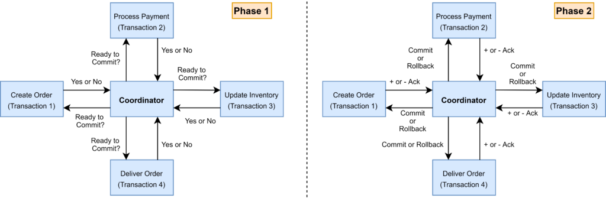

# Two-Phase Commit

Let's begin from `two-phase commit` because it super basic and very understandable. 

As the name indicates, the two-phase commit protocol runs a distributed transaction in two phases:

* Prepare Phase – The coordinator asks the participating nodes whether they are ready to commit the transaction. The participants returned with a yes or no.
* Commit Phase – If all the participating nodes respond affirmatively in phase 1, the coordinator asks all of them to commit. If at least one node returns negative, the coordinator asks all participants to roll back their local transactions.

### Problem with 2PC
Although 2PC is useful to implement a distributed transaction, it has the following shortcomings:

* The onus of the transaction is on the coordinator node, and it can become the single point of failure.
* All other services need to wait until the slowest service finishes its confirmation. So, the overall performance of the transaction is bound by the slowest service.
* The two-phase commit protocol is slow by design due to the chattiness and dependency on the coordinator. So, it can lead to scalability and performance issues in a microservice-based architecture involving multiple services.
* Two-phase commit protocol is not supported in NoSQL databases. Therefore, in a microservice architecture where one or more services use NoSQL databases, we can’t apply a two-phase commit.

